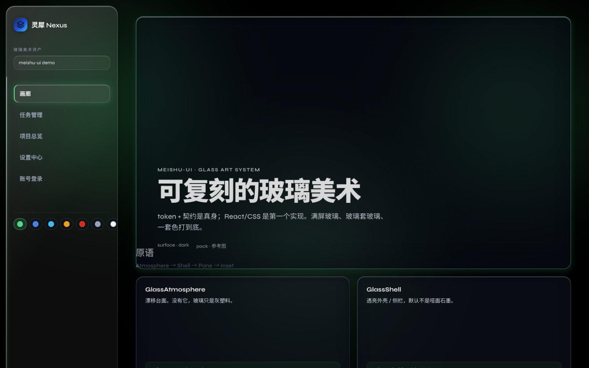
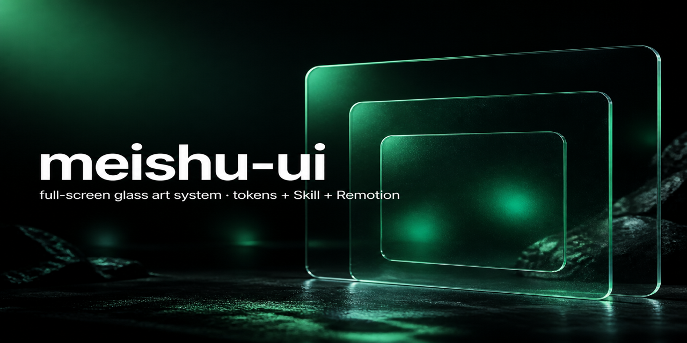

# meishu-ui

<p align="center">
  <a href="https://qixian771-spec.github.io/meishu-ui/">
    
  </a>
</p>

<p align="center">
  <strong>Full-screen glass art system</strong> — tokens + Skill contract + React/CSS + Remotion precomposed.<br/>
  满屏玻璃美术资产：真身是 <strong>token + 契约</strong>；Web 走 <code>Glass*</code>，视频走 <code>Precomposed*</code>。
</p>

<p align="center">
  <a href="https://qixian771-spec.github.io/meishu-ui/"></a>
  <a href="LICENSE"></a>
  <a href="https://github.com/qixian771-spec/meishu-ui/releases/tag/v2.1"></a>
  
</p>

<p align="center">
  <a href="https://qixian771-spec.github.io/meishu-ui/"><b>Live Demo</b></a> ·
  <a href="docs/FRAMEWORK.md">Framework</a> ·
  <a href="skill/meishu-ui/">Skill</a> ·
  <a href="src/glass/README.md">src/glass</a>
</p>

> Demo gallery is an **acceptance stage**, not a product UI.

## Quick start

```bash
npm install
npm run dev          # http://localhost:5173
npm test
npm run build
```

## Remotion (v2.1)

```bash
npm run remotion:studio
```

Composition: `PrecomposedDemo`.

## Integrate (Web)

```ts
import {
  applyThemeTokens,
  resolveThemeTokens,
  GlassAtmosphere,
  GlassShell,
  GlassPane,
  GlassInset,
} from './src/glass';
import './src/glass/css/index.css';

applyThemeTokens(resolveThemeTokens('ref123'));
```

Precomposed / video: see [`skill/meishu-ui/references/recipes-precomposited.md`](skill/meishu-ui/references/recipes-precomposited.md).

## Theme packs

`ref123` · `klein` · `sky` · `amber` · `cinnabar` · `chrome` · `white` (light)

## Hard don'ts

1. No `filter` on ancestors of **live** Web glass
2. Don't ship glass over an opaque stage — need Atmosphere
3. No hardcoded brand hues — use accent / wash tokens
4. Nest blur ≤ 2 depths; deeper → tint-only

## Status

| Milestone | What |
|-----------|------|
| [v2.0](https://github.com/qixian771-spec/meishu-ui/releases/tag/v2.0) | `Glass*` live glass, 7 packs, gallery, Skill |
| [v2.1](https://github.com/qixian771-spec/meishu-ui/releases/tag/v2.1) | `Precomposed*` + Remotion demo |

## Manage this repo (cheat sheet)

| What | How |
|------|-----|
| About / topics / homepage | `gh repo edit --description … --homepage … --add-topic …` |
| Live demo | GitHub Actions → Pages (`.github/workflows/pages.yml`) |
| Social preview card | Settings → General → Social preview → upload `docs/media/og.png` |
| Releases | Tags `v2.0` / `v2.1` already pushed |
| README is the homepage | First image + badges = first screen visitors see |

## License

MIT — see [LICENSE](LICENSE).

Visual inspiration only: ClauseOS / RonDesignLab. Not affiliated.

<p align="center">
  
</p>
